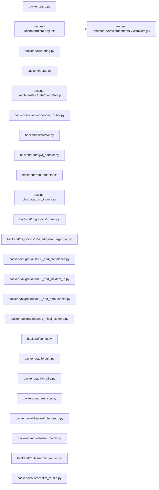

## ARCHITECTURE

A software project composed of the following subsystems:

- **backend/**: Primary subsystem containing 24 files
- **rescue-dashboard/**: Primary subsystem containing 14 files
- **Root**: Contains scripts and execution points

## ENTRY_POINTS

### `backend/app.py`

```python
import eventlet
eventlet.monkey_patch()
from flask import Flask, jsonify, request
from flask_socketio import SocketIO
from flask_cors import CORS
import sqlite3
from datetime import datetime
from ml_model import predict_triage
from clustering import calculate_hotspots
from math import radians, cos, sin, asin, sqrt
import uuid
import os
import qrcode
import io
import base64

from auth.register import register_bp
from auth.login import login_bp
from auth.profile import profile_bp
from routes.victim_routes import victim_bp
from routes.responder_routes import responder_bp
from routes.admin_routes import admin_bp
from middleware.role_guard import require_auth, require_role
from config import DB_PATH, DEFAULT_INCIDENT_ID

from migrations.runner import run_migrations
run_migrations()  # safe to call on every startup

app = Flask(__name__)

# Match SocketIO CORS with REST CORS — only accept from known dashboard origin
ALLOWED_ORIGINS = ["http://localhost:5173", "http://127.0.0.1:5173"]
socketio = SocketIO(app, cors_allowed_origins=ALLOWED_ORIGINS)
CORS(app, resources={r"/api/*": {"origins": ALLOWED_ORIGINS}})

# Register Auth Blueprints
app.register_blueprint(register_bp, url_prefix='/api/auth')
app.register_blueprint(login_bp, url_prefix='/api/auth')
app.register_blueprint(profile_bp, url_prefix='/api/auth')

# Register Feature Blueprints
app.register_blueprint(victim_bp)
app.register_blueprint(responder_bp)
app.register_blueprint(admin_bp)

# DB_PATH is now loaded from config.py

def get_db_connection():
    conn = sqlite3.connect(DB_PATH, timeout=30)
    conn.row_factory = sqlite3.Row
    return conn

def get_distance(lat1, lon1, lat2, lon2):
    R = 6371.0
    lat1, lon1, lat2, lon2 = map(radians, [lat1, lon1, lat2, lon2])
    dlat, dlon = lat2 - lat1, lon2 - lon1
    a = sin(dlat / 2)**2 + cos(lat1) * cos(lat2) * sin(dlon / 2)**2
    return R * (2 * asin(sqrt(a)))

def match_hospital(victim_lat, victim_lng):
    try:
        conn = get_db_connection()
        hospitals = conn.execute('SELECT * FROM hospitals WHERE available_beds > 0').fetchall()
        conn.close()
        best_hospital = None
        min_distance = float('inf')
        for h in hospitals:
            dist = get_distance(victim_lat, victim_lng, h['lat'], h['lng'])
            if dist < min_distance:
                min_distance = dist
                best_hospital = h
        return best_hospital
    except Exception as e:
        print(f"Hospital Match Error: {e}")
        return None

def run_clustering(incident_id=DEFAULT_INCIDENT_ID):
    try:
        calculate_hotspots(incident_id)
        socketio.emit('clusters_updated', {'incident_id': incident_id})
    except Exception as e:
        print(f"Background Clustering Error: {e}")

# --- API ROUTES ---

@app.route('/api/ingest', methods=['POST'])
@require_role('responder', 'admin')
def ingest_data():
    data = request.json
    if not data:
        return jsonify({"error": "No data received"}), 400

    # Validate required fields
    required = ['age', 'heart_rate', 'spo2', 'temperature', 'lat', 'lng']
    missing = [f for f in required if f not in data]
    if missing:
        return jsonify({"error": f"Missing required fields: {missing}"}), 400

    # Use UUID to avoid ID collisions
    victim_id = f"V-{uuid.uuid4().hex[:8].upper()}"

    try:
        severity = predict_triage(
            data['age'], data['heart_rate'], data['spo2'], data['temperature']
        )
    except Exception as e:
        print(f"ML Prediction Error: {e}")
        severity = 1  # Fallback to moderate

    matched_hosp = match_hospital(data['lat'], data['lng'])
    hosp_name = matched_hosp['name'] if matched_hosp else "Waitlisted"

    conn = None
    try:
        conn = get_db_connection()
        incident_id = data.get('incident_id', DEFAULT_INCIDENT_ID)
        conn.execute('''
            INSERT INTO victims (id, age, heart_rate, spo2, temperature, triage_level, lat, lng, timestamp, status, hospital_assigned, incident_id)
            VALUES (?, ?, ?, ?, ?, ?, ?, ?, ?, ?, ?, ?)
        ''', (
            victim_id, data['age'], data['heart_rate'], data['spo2'], data['temperature'],
            severity, data['lat'], data['lng'], datetime.now().isoformat(), 'unassigned', hosp_name, incident_id
        ))
        if matched_hosp:
            conn.execute('UPDATE hospitals SET available_beds = available_beds - 1 WHERE id = ?', (matched_hosp['id'],))
        conn.commit()
    except sqlite3.Error as e:
        print(f"Database Insertion Error: {e}")
        if conn: conn.rollback()
        return jsonify({"error": "Database error", "details": str(e)}), 500
    finally:
        if conn: conn.close()

    socketio.start_background_task(run_clustering, incident_id)

    socketio.emit('victim_ingested', {
        'id': victim_id,
        'triage_level': severity,
        'lat': data['lat'],
        'lng': data['lng'],
        'hospital_assigned': hosp_name,
        'timestamp': datetime.now().isoformat(),
        'incident_id': incident_id
    })

    return jsonify({
        "status": "success",
        "victim_id": victim_id,
        "predicted_severity": severity,
        "assigned_to": hosp_name
    }), 201

@app.route('/api/ambulances', methods=['GET'])
@require_auth
def get_ambulances():
    """Return all ambulances from the database."""
    try:
        conn = get_db_connection()
        rows = conn.execute('SELECT * FROM ambulances ORDER BY id').fetchall()
        conn.close()
        return jsonify([dict(r) for r in rows])
    except Exception as e:
        return jsonify({"error": str(e)}), 500

@app.route('/api/ambulances/<amb_id>/status', methods=['PATCH'])
@require_role('responder', 'admin')
def update_ambulance_status(amb_id):
    """Update an ambulance's status and optionally its assigned victim."""
    data = request.json
    if not data or 'status' not in data:
        return jsonify({"error": "'status' field is required"}), 400
    new_status = data['status'].lower()
    if new_status not in ('available', 'busy', 'offline'):
        return jsonify({"error": "status must be available, busy, or offline"}), 400
    assigned_victim = data.get('assigned_victim', None)
    conn = None
    try:
        conn = get_db_connection()
        row = conn.execute("SELECT id FROM ambulances WHERE id = ?", (amb_id,)).fetchone()
        if not row:
            return jsonify({"error": "Ambulance not found"}), 404
        conn.execute(
            "UPDATE ambulances SET status = ?, assigned_victim = ? WHERE id = ?",
            (new_status, assigned_victim, amb_id)
        )
        conn.commit()
        socketio.emit('ambulance_updated', {'amb_id': amb_id, 'status': new_status, 'assigned_victim': assigned_victim})
        return jsonify({"status": new_status, "amb_id": amb_id}), 200
    except sqlite3.Error as e:
        if conn: conn.rollback()
        return jsonify({"error": str(e)}), 500
    finally:
        if conn: conn.close()

@app.route('/api/assign/<victim_id>', methods=['POST'])
@require_role('responder', 'admin')
def assign_victim(victim_id):
    """Mark a victim as dispatched and auto-assign the nearest available ambulance."""
    conn = None
    try:
        conn = get_db_connection()
        victim = conn.execute("SELECT * FROM victims WHERE id = ?", (victim_id,)).fetchone()
        if not victim:
            return jsonify({"error": "Victim not found"}), 404
        if victim['status'] == 'assigned':
            return jsonify({"message": "Already assigned", "victim_id": victim_id}), 200

        conn.execute("UPDATE victims SET status = 'assigned' WHERE id = ?", (victim_id,))

        # Auto-assign the nearest available ambulance
        ambulances = conn.execute(
            "SELECT * FROM ambulances WHERE status = 'available'"
        ).fetchall()
        assigned_amb = None
        if ambulances and victim['lat'] and victim['lng']:
            nearest = min(
                ambulances,
                key=lambda a: get_distance(victim['lat'], victim['lng'], a['lat'], a['lng'])
            )
            conn.execute(
                "UPDATE ambulances SET status = 'busy', assigned_victim = ? WHERE id = ?",
                (victim_id, nearest['id'])
            )
            assigned_amb = nearest['id']

        conn.commit()
        socketio.emit('victim_assigned', {'victim_id': victim_id, 'ambulance_id': assigned_amb})
        if assigned_amb:
            socketio.emit('ambulance_updated', {'amb_id': assigned_amb, 'status': 'busy', 'assigned_victim': victim_id})
        return jsonify({"status": "assigned", "victim_id": victim_id, "ambulance_assigned": assigned_amb}), 200
    except sqlite3.Error as e:
        if conn: conn.rollback()
        return jsonify({"error": str(e)}), 500
    finally:
        if conn: conn.close()

@app.route('/api/victims/<victim_id>/discharge', methods=['PATCH'])
@require_role('responder', 'admin')
def discharge_victim(victim_id):
    """
    Mark a victim as discharged and increment the available beds
    at their assigned hospital (capped at total_beds).
    """
    conn = None
    try:
        conn = get_db_connection()
        victim = conn.execute("SELECT * FROM victims WHERE id = ?", (victim_id,)).fetchone()
        if not victim:
            return jsonify({"error": "Victim not found"}), 404
        if victim['status'] == 'discharged':
            return jsonify({"message": "Already discharged", "victim_id": victim_id}), 200

        discharged_at = datetime.now().isoformat()
        conn.execute(
            "UPDATE victims SET status = 'discharged', discharged_at = ? WHERE id = ?",
            (discharged_at, victim_id)
        )

        # Replenish one bed at the assigned hospital, capped at total_beds
        updated_hospital = None
        if victim['hospital_assigned'] and victim['hospital_assigned'] != 'Waitlisted':
            hospital = conn.execute(
                "SELECT * FROM hospitals WHERE name = ?", (victim['hospital_assigned'],)
            ).fetchone()
            if hospital:
                new_beds = min(hospital['available_beds'] + 1, hospital['total_beds'])
                conn.execute(
                    "UPDATE hospitals SET available_beds = ? WHERE id = ?",
                    (new_beds, hospital['id'])
                )
                updated_hospital = {
                    'id': hospital['id'],
                    'name': hospital['name'],
                    'available_beds': new_beds,
                    'total_beds': hospital['total_beds']
                }

        conn.commit()
        socketio.emit('victim_discharged', {
            'victim_id': victim_id,
            'hospital': updated_hospital
        })
        return jsonify({
            "status": "discharged",
            "victim_id": victim_id,
            "hospital_beds_updated": updated_hospital
        }), 200
    except sqlite3.Error as e:
        if conn: conn.rollback()
        return jsonify({"error": str(e)}), 500
    finally:
        if conn: conn.close()

@app.route('/api/hospitals/<int:hospital_id>/replenish', methods=['POST'])
@require_role('admin')
def replenish_hospital(hospital_id):
    """
    Manually add beds back to a hospital (admin use).
    Accepts { "beds": N } — adds N beds, capped at total_beds.
    """

... (truncated: entry point exceeds 300 lines)
```

## SYMBOL_INDEX

**`rescue-dashboard/src/components/VictimCard.jsx`**
- `VictimCard()`

**`backend/app.py`**
- `get_db_connection()`
- `get_distance()`
- `match_hospital()`
- `run_clustering()`
- `ingest_data()`
- `get_ambulances()`
- `update_ambulance_status()`
- `assign_victim()`
- `discharge_victim()`
- `replenish_hospital()`
- `get_incidents()`
- `create_incident()`
- `get_victims()`
- `get_clusters()`
- `get_hospitals()`

**`rescue-dashboard/src/App.jsx`**
- `createIcon()`
- `IncidentTimeline()`
- `App()`

**`backend/clustering.py`**
- `get_distance()`
- `calculate_hotspots()`

**`backend/setup.py`**
- `seed_data()`

**`backend/routes/responder_routes.py`**
- `get_db()`
- `haversine()`
- `dashboard()`
- `optimize_route()`

**`backend/simulator.py`**
- `login()`
- `send_victim()`
- `run_simulator()`

**`backend/auth/jwt_handler.py`**
- `sign_jwt()`
- `decode_jwt()`

**`backend/migrations/runner.py`**
- `run_migrations()`

**`backend/migrations/004_add_discharged_at.py`**
- `up()`

**`backend/migrations/005_add_confidence.py`**
- `up()`

**`backend/migrations/002_add_incident_id.py`**
- `up()`

**`backend/migrations/003_add_ambulances.py`**
- `up()`

**`backend/migrations/001_initial_schema.py`**
- `up()`

## IMPORTANT_CALL_PATHS

app.get_db_connection()
## CORE_MODULES

### `rescue-dashboard/src/components/VictimCard.jsx`

**Purpose:** Implements VictimCard.

**Functions:**
- `function VictimCard({ victimId })`

### `rescue-dashboard/src/App.jsx`

**Purpose:** Implements App.

**Functions:**
- `function App()`
- `const IncidentTimeline = ...`
- `const createIcon = ...`

**Notes:** large file (1078 lines)

### `backend/clustering.py`

**Purpose:** Implements clustering.

**Functions:**
- `def calculate_hotspots(incident_id=DEFAULT_INCIDENT_ID)`
- `def get_distance(lat1, lon1, lat2, lon2)`

### `backend/setup.py`

**Purpose:** Implements setup.

**Functions:**
- `def seed_data()`

### `rescue-dashboard/src/data/mockData.js`

**Purpose:** Implements mockData.

## SUPPORTING_MODULES

### `backend/routes/responder_routes.py`

```python
def get_db()

def haversine(lat1, lng1, lat2, lng2)
    """Straight-line distance in km between two GPS points."""

def dashboard()

def optimize_route()
    """Greedy nearest-neighbour route from an ambulance's current position
    through all unassigned victims within radius_km (default 2 km).

    Request body (JSON):
    {
      "lat": 13.082,
      "lng": 80.270,
      "radius_km": 2.0  # optional
    }"""

```

### `README.md`

*80 lines, 0 imports*

### `backend/simulator.py`

```python
def login()

def send_victim(i, wave_count)

def run_simulator()

```

### `backend/auth/jwt_handler.py`

```python
def sign_jwt(user_id: str, role: str) -> str

def decode_jwt(token: str)

```

### `backend/requirements.txt`

*16 lines, 0 imports*

### `rescue-dashboard/src/index.css`

*92 lines, 0 imports*

### `backend/migrations/runner.py`

```python
def run_migrations()

```

### `backend/migrations/004_add_discharged_at.py`

```python
def up(cursor)

```

### `backend/migrations/005_add_confidence.py`

```python
def up(cursor)

```

### `backend/migrations/002_add_incident_id.py`

```python
def up(cursor)

```

### `backend/migrations/003_add_ambulances.py`

```python
def up(cursor)

```

### `backend/migrations/001_initial_schema.py`

```python
def up(cursor)

```

## DEPENDENCY_GRAPH



## RANKED_FILES

| File | Score | Tier | Tokens |
|------|-------|------|--------|
| `rescue-dashboard/src/components/VictimCard.jsx` | 0.556 | structured summary | 33 |
| `backend/app.py` | 0.514 | full source | 2734 |
| `rescue-dashboard/src/App.jsx` | 0.500 | structured summary | 51 |
| `backend/clustering.py` | 0.242 | structured summary | 49 |
| `backend/setup.py` | 0.214 | structured summary | 23 |
| `rescue-dashboard/src/data/mockData.js` | 0.185 | structured summary | 18 |
| `backend/routes/responder_routes.py` | 0.185 | signatures | 125 |
| `README.md` | 0.185 | signatures | 13 |
| `backend/simulator.py` | 0.166 | signatures | 29 |
| `backend/auth/jwt_handler.py` | 0.156 | signatures | 36 |
| `backend/requirements.txt` | 0.156 | signatures | 15 |
| `rescue-dashboard/src/index.css` | 0.156 | signatures | 17 |
| `backend/migrations/runner.py` | 0.100 | signatures | 19 |
| `backend/migrations/004_add_discharged_at.py` | 0.100 | signatures | 22 |
| `backend/migrations/005_add_confidence.py` | 0.100 | signatures | 21 |
| `backend/migrations/002_add_incident_id.py` | 0.100 | signatures | 22 |
| `backend/migrations/003_add_ambulances.py` | 0.100 | signatures | 23 |
| `backend/migrations/001_initial_schema.py` | 0.100 | signatures | 20 |
| `backend/config.py` | 0.100 | one-liner | 11 |
| `backend/auth/login.py` | 0.097 | one-liner | 20 |
| `backend/auth/profile.py` | 0.097 | one-liner | 20 |
| `backend/auth/register.py` | 0.097 | one-liner | 20 |
| `backend/middleware/role_guard.py` | 0.097 | one-liner | 23 |
| `backend/models/user_model.py` | 0.097 | one-liner | 21 |
| `backend/routes/admin_routes.py` | 0.097 | one-liner | 21 |
| `backend/routes/victim_routes.py` | 0.097 | one-liner | 22 |
| `backend/test_auth.py` | 0.097 | one-liner | 20 |
| `backend/ml_model.py` | 0.029 | one-liner | 20 |
| `backend/triage_model.txt` | 0.029 | one-liner | 14 |
| `.gitignore` | 0.029 | one-liner | 10 |
| `rescue-dashboard/.gitignore` | 0.029 | one-liner | 14 |
| `rescue-dashboard/README.md` | 0.029 | one-liner | 14 |
| `rescue-dashboard/eslint.config.js` | 0.029 | one-liner | 19 |
| `rescue-dashboard/index.html` | 0.029 | one-liner | 13 |
| `rescue-dashboard/postcss.config.js` | 0.029 | one-liner | 15 |
| `rescue-dashboard/public/vite.svg` | 0.029 | one-liner | 15 |
| `rescue-dashboard/src/App.css` | 0.029 | one-liner | 14 |
| `rescue-dashboard/src/main.jsx` | 0.029 | one-liner | 18 |
| `rescue-dashboard/tailwind.config.js` | 0.029 | one-liner | 16 |
| `rescue-dashboard/vite.config.js` | 0.029 | one-liner | 19 |

## PERIPHERY

- `backend/config.py` — 4 lines
- `backend/auth/login.py` — 1 function, 4 imports, 27 lines
- `backend/auth/profile.py` — 1 function, 3 imports, 22 lines
- `backend/auth/register.py` — 1 function, 5 imports, 41 lines
- `backend/middleware/role_guard.py` — 2 functions, 3 imports, 59 lines
- `backend/models/user_model.py` — 4 functions, 3 imports, 37 lines
- `backend/routes/admin_routes.py` — 1 function, 2 imports, 15 lines
- `backend/routes/victim_routes.py` — 2 functions, 5 imports, 45 lines
- `backend/test_auth.py` — 1 class, 4 imports, 64 lines
- `backend/ml_model.py` — 1 function, 2 imports, 19 lines
- `backend/triage_model.txt` — 38145 lines
- `.gitignore` — 32 lines
- `rescue-dashboard/.gitignore` — 25 lines
- `rescue-dashboard/README.md` — 17 lines
- `rescue-dashboard/eslint.config.js` — 5 imports, 30 lines
- `rescue-dashboard/index.html` — 14 lines
- `rescue-dashboard/postcss.config.js` — 6 lines
- `rescue-dashboard/public/vite.svg` — 1 lines
- `rescue-dashboard/src/App.css` — 43 lines
- `rescue-dashboard/src/main.jsx` — 4 imports, 11 lines
- `rescue-dashboard/tailwind.config.js` — 11 lines
- `rescue-dashboard/vite.config.js` — 2 imports, 11 lines

